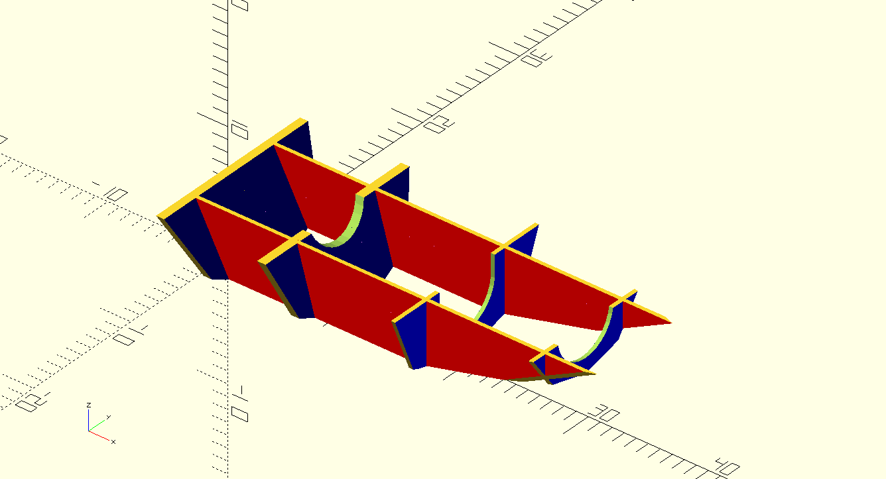
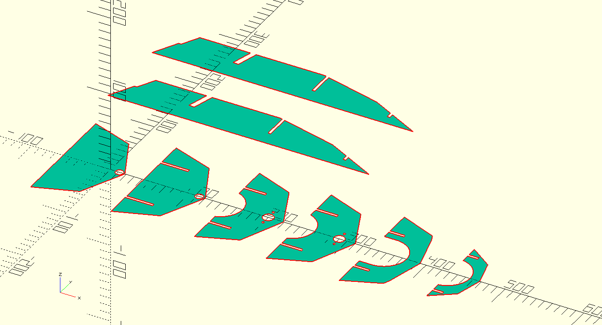

# dtv-boat

Zdrojáky a súbory k návrhu loďky na diaľkové ovládanie na predmet Digitálne technológie výroby.

## Úvod a popis lode

Cieľom projektu je postaviť diaľkovo ovládanú loďku.
Loďka bude z dreva (preglejka/balza), ktoré bude rezané na laseri.
Lodná skrutka, kormidlo a konzola kormidla bude tlačené na 3D tlačiarni.
Elektronická časť modelu sa skladá z 2,4GHz pištoľovej vysielačky a prijímača.
Pohon modelu sa skladá z jednosmerného (brushed) 21 závitového (21T) motora typu 550.
Regulátor je 80A na 2-3 článkovú LiXX alebo 4-9 článkovú Ni-XX baterku.
Regulátor má vstavaný 5A BEC, ktorý ale má 7.4V/6.4V.
Keďže prijímač a servo je do 6V, tak ho možno budeme musieť regulovať na menšie napätie, čo zrejme budeme robiť výkonovou diódou.
Ovládanie kormidla zabezpečuje 3kg servo, ktoré je dvojicou bowdenov spojené s kormidlom.

Chladenie motoru a regulátoru je vodné. Voda je odoberaná za lodnou skrutkou, odkiaľ je tlakom hnaná cez regulátor a následne motor.
Pre motor sme kúpili medený vodný chladič, pre regulátor bude vyrobený z tenkej medenej/mosadznej trubky vloženej medzi rebrovanie chladiča.

Výkon je z motoru vedený krížovým kĺbom priamo hriadeľ s lodnou skrutkou bez prevodovky alebo redukcie.
Hriadeľ je cez dvojicu ložísk osadená v puzdre, ktoré je vlepené do trupu lode.

## Lodná skrutka

Lodná skrutka je navrhnutá v programe OpenSCAD. [Zdrojový kód](propeller/propeller.scad) je v repozitári.
List lodnej skutky má elipsový tvar a je prehnutý (`skew`). List má po celej svojej dĺžky rovnaký profil, mení sa iba jeho hĺbka.
Profil listu je zo 4 číslnej NACA série, pre našu loď bol vybratý profil NACA 2412, t.j. prehnutý profil s 12% hrúbkou.
List je samozrejme pre zachovanie koštantného stúpania počas celej dĺžky skrútený
( $\alpha = atan2(S, (2*3.14159*r))$ , kde $S$ je stúpanie listu a $r$ je vzdialenosť osi otáčania).

Zrejme budeme počas vývoja experimentovať s rôznymi priemermi a stúpaniami skutky.

## Trup lode

Trup lode je klasická drevená konštrukcia s preglejkovými priečkami a opláštením.
V trupe sa nachádzajú 4 priečne priečky (z toho zadná je zdvojená a tvorí zadnú časť lode) a 2 pozdĺžne.
Priečky rezané na laseri a sú z 3mm hrubej preglejky.

Opláštenie lode je z 0,8mm hrubej preglejky rezanej na laseri.

Trup lode je opäť navrhnutý v OpenSCADe a tvary priečok sú vyexportované priamo z tohoto programu.
[Zdrojový kód](boat.scad) je tiež v repozitári.

