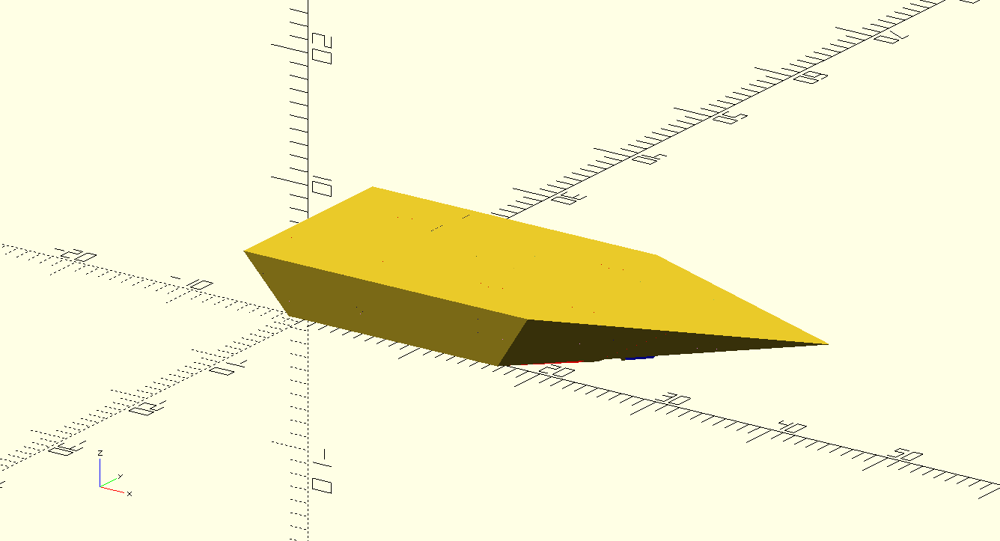

# dtv-boat

Zdrojáky a súbory k návrhu loďky na diaľkové ovládanie na predmet Digitálne technológie výroby.

## Úvod a popis lode

Cieľom projektu je postaviť diaľkovo ovládanú loďku.
Loďka bude z dreva (preglejka/balza), ktoré bude rezané na laseri.
Lodná skrutka, kormidlo a konzola kormidla bude tlačené na 3D tlačiarni.
Elektronická časť modelu sa skladá z 2,4GHz pištoľovej vysielačky a prijímača.
Pohon modelu sa skladá z jednosmerného (brushed) 21 závitového (21T) motora typu 550.
Regulátor je 80A na 2-3 článkovú LiXX alebo 4-9 článkovú Ni-XX baterku.
Regulátor má vstavaný 5A BEC, ktorý ale má 7.4V/6.4V.
~~Keďže prijímač a servo je do 6V, tak ho možno budeme musieť regulovať na menšie napätie,
čo zrejme budeme robiť výkonovou diódou.~~ Edit: servo aj prijímač 6.4V napájanie zvládnu, takže nakoniec takéto nebolo potrebné.
Ovládanie kormidla zabezpečuje 3kg servo, ktoré je dvojicou bowdenov spojené s kormidlom.

Chladenie motoru a regulátoru je vodné. Voda je odoberaná za lodnou skrutkou na kormidle, odkiaľ je tlakom hnaná cez regulátor a následne motor.
Pre motor sme kúpili medený vodný chladič, pre regulátor bol vyrobený z tenkej medenej/hliníkovej trubky vloženej medzi rebrovanie chladiča.

Výkon je z motoru vedený kardanovým kĺbom priamo na hriadeľ s lodnou skrutkou bez prevodovky alebo redukcie.
Hriadeľ je cez dvojicu ložísk osadená v puzdre, ktoré je vlepené do trupu lode.

## Lodná skrutka

Lodná skrutka je navrhnutá v programe OpenSCAD. [Zdrojový kód](propeller/propeller.scad) je v repozitári.
List lodnej skutky má elipsový tvar a je prehnutý (`skew`). List má po celej svojej dĺžky rovnaký profil, mení sa iba jeho hĺbka.
Profil listu je zo 4 číslnej NACA série, pre našu loď bol pôvodne vybratý profil NACA 2412, t.j. prehnutý profil s 12% hrúbkou.
List je samozrejme pre zachovanie koštantného stúpania počas celej dĺžky skrútený
( $\alpha = atan2(S, 2 \pi r)$ , kde $S$ je stúpanie listu a $r$ je vzdialenosť osi otáčania).

Zrejme budeme počas vývoja experimentovať s rôznymi priemermi, stúpaniami skutky a profilmi.

*Profil NACA 2412:*

*Jeden list:*

*Kompletná lodná skrutka aj s nábojom:*

## Trup lode

Trup lode je klasická drevená konštrukcia s preglejkovými priečkami a opláštením.
V trupe sa nachádzajú 4 priečne priečky (z toho posledné dve sú zdvojené) a 2 pozdĺžne.
Priečky rezané na laseri a sú z 3mm hrubej preglejky.

Opláštenie lode je z 1.5mm hrubej preglejky rezanej na laseri.

Trup lode je opäť navrhnutý v OpenSCADe a tvary priečok sú vyexportované priamo z tohoto programu.
[Zdrojový kód](boat.scad) je tiež v repozitári.

*Trup lode:*

*Priečky v lodi:*

*Priečky pripravené na rezanie:*

Opláštenie lode nie je priamo z OpenSCADu.
Namiesto toho sú z programu vyexportované súradnice vrcholov útvarov z ktorých sa opláštenie skladá.
Tieto útvary sú následne Python skriptom zrotované a sú vypočítané ich súradnice.
[Python skript](rotate_3d_polygons.py) je opäť v repozitári.

## Konzola kormidla a kormidlo

Konzola kormidla a kormmidlo boli navrhnuté v OpenSCADe a vytlačené na 3D tlačiarni.
Konzola má obdĺžnikový prierez a je k trupu lode cez plochú doštičku pripevnená štyrmi skrutkami M3.
Na konci konzoly je miesto na osku kormidla.
Oska je z nerezového drôtu priemeru 3.2mm a na vrchu je závlačkou pripevnená ku konzole.
Profil kormidla je rovnostranný trojuholník otočený základňou od smeru plavby.
Vo vnútri kormidla sa nachádza kanál na vstup chladiacej vody.
Vstup tohoto kanálu je otočený smerom k lodnej skrutke, aby tlačila vodu cez chladiaci kanál.
Z výstupu vodného kanála na vrchnej časti lode je voda odvádzaná umelohmotnou hadičkou ďalej do trupu lode.
Na vrchnej časti kormidla sa nachádzajú páky riadenia.

*Konzola kormidla aj s kormidlom (v zadnej časti kormidla je viditeľný kanál na chladiacu vodu):*

## Stavba lode

Stavba lode začala narezaním potrebných dielov na laserovej rezačke.
Následne boli zlepené vnútorné priečky lode a vlepený hriadeľ a opláštenie lode.

*Vnútorné priečky:*

Do lode bol osadený motor a urobené lôžko na servo priečku.

*Detail kardanového kĺbu, motoru v silentblokoch a hranolčekoch pod servo priečku:*

Stavba lode pokračovala prilepením horného opláštenia.
Týmto bola stavba drevenej konštrukcie lode hotová.

*Opláštená loďka:*

Pokračovali sme olamimnovaním celého trupu lode dvomi vrstvami sklenej tkaniny gramáže $80 g/m^2$.
Laminovali sme epoxidovou živicou L285.

*Laminovanie:*

Pri hranách, kde pod tkaninou vznikli bubliny sme ich odbrúsili a tieto miesta prelaminovali opäť.
Nasledovala povrchová úprava trupu.
Trup bol najprv vytmelený polyesterovým tmelom (gitom) a namokro prebrúsený.

*Vygitovaný trup:*

Následne bol trup nastriekaný plničom.

*Trup nastriekaný plničom:*

Po finálnom mokrom prebrúsení bol trup nastriekaný vrchnou farbou.
Ako kamufláž bola zvolená bola modro-ružová farebná kombinácia (RAL 5002, RAL 4003).

*Kamufláž lode:*

Paralelene s dokončovaním trupu prebiehal návrh a tlač kormidla a konzoly kormidla.
Boli tiež vytlačené vrchné kryty lode a lodná skrutka.

*Vytlačené kormidlo:*

*Výsledná loďka bez jedného vrchného krytu:*

## Testy lode a skúsenosti z používania

Loďka bola 15.5.2024 prvý krát vyskúšaná na vode, najprv vo vani a potom na Karloveskom ramene.
Vodné chladenie fungovalo bez problémov.
Kormidlo je dostatočne účinné a nevykazuje žiadne problémy s vôľami.
Loďka má pomerne veľký ponor, iba 1-2cm pod vrchnú hrany trupu.
Loďka je premotorovaná, takže s pôvodnou lodnou skrutkou priemeru 36mm (stúpanie neznáme, odhadom okolo 40mm)
nad tretinu plynu dochádza ku výraznej kavitácii, čo sa prejaví tvorbou veľkého množstva vzduchu za loďkou,
hrabaním skrutky vo vzduchu, zvýšeným hlukom a znížením rýchlosti loďky.

Z tohoto dôvodu bola na 3D tlačiarni vytlačená druhá skrutka s priemerom 40mm a stúpaním 48mm,
ktorá ale problém kavitácie neodstránila, ostal približne rovnaký.
Pri skúškach tejto lodnej skrutky sa prejavil ešte jeden problém:
cez bowdeny riadenia kormidla, popri tiahlach natiekla do loďky voda, vtiekla do serva,
kde vtiekla zrejme do potenciometra, ktorý sníma polohu výstupnej páky.
Je tiež možné, že voda zoskratovala niektoré častí elektroniky.
Následkom tohoto sa servo vychýlilo na jeden doraz (odpozorovaný jav)
a zrejme sa začalo mykať (toto sme bezprostredne na vode nevideli, ale počas skúšok serva na zemi sa prejavilo).
Týmto servo preťažilo BEC napájací obvod v regulátore na ktorom sa zapla ochrana proti preťaženiu
a servo prestalo byť napájané. Samozrejme, napájaný prestal byť aj prijímač, takže loďka prestala reagovať na ovládanie.
Nasledovalo plávanie za neovládanou loďkou.

### Zmeny oproti plánu

- Kvôli vode vtekajúcej do trupu cez bowdeny sme utesnili tiahla gumenými manžetami.
- Pôvodný plán bol zaisťovať vrchné kryty na trupe pomocou otočných poistiek ("camlockov"). Tieto poistky sa ale lámali a nemali žiadnu možnosť pritiahnutia krytov ku lodi, preto boli nahradené "klinmi".

### Odporúčania do budúcnosti

Loďka vyšla pomerne ťažká (takmer presných 1000g), čo sa prejavilo na jej veľkom ponore.
Riešenie je asi urobiť loďku o 10cm dlhšiu (55cm) pri zachovaní počtu vnútorných priečok.
Tiež je možné vnútorné priečky urobiť z tenšej preglejky (2mm by boli úplne dostatočné),
keďže aktuálne je loďka zbytočne pevná (aj opláštenie môže byť tenšie, pokojne 1mm).

Tiež mohol byť pre loď zvolený menší motor (540 by bolo úplne v poriadku), ktorý bude mať menšie otáčky.
